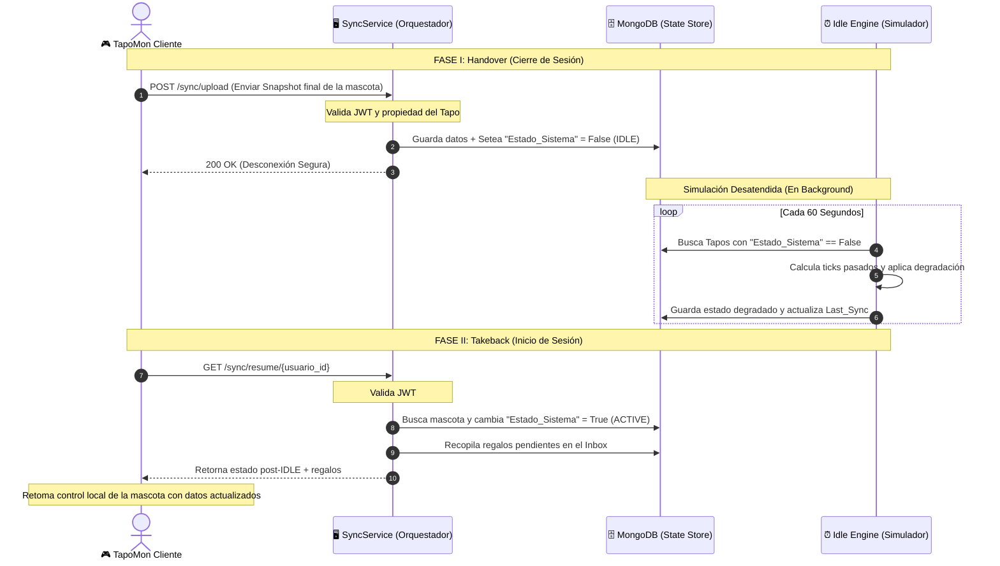

# Arquitectura y Estado de la Capa de Servidor TapoMon

Este documento presenta una explicación detallada del diseño arquitectónico, el estado de implementación actual de los componentes del servidor y un análisis conceptual sobre el papel del **SyncService** como orquestador en el ciclo de vida de las mascotas virtuales.

---

## 1. Estado Actual de la Implementación: ¿Es solo una estructura?

**No. El servidor central no es un mero esqueleto o estructura de conexiones; es un sistema completamente funcional y operativo.** 

A diferencia de un simple prototipo con mocks o endpoints vacíos, los servicios backend están programados con lógica de negocio real, persistencia interactiva en base de datos y un motor de simulación temporal en tiempo real:

| Componente | Módulo / Ruta en Servidor | Nivel de Implementación | Descripción |
| :--- | :--- | :--- | :--- |
| **Persistencia Global** | [db/mongo.py](file:///c:/Users/usuario/Desktop/TapoMon/TapoMon/server/db/mongo.py) | **100% Funcional** | Maneja la conexión singleton a MongoDB, creación automática de índices únicos (usuarios, mascotas, inbox) y resolución insensible a mayúsculas para bases de datos existentes. |
| **Autenticación (JWT)** | [api/auth_routes.py](file:///c:/Users/usuario/Desktop/TapoMon/TapoMon/server/api/auth_routes.py)<br>[services/auth_service.py](file:///c:/Users/usuario/Desktop/TapoMon/TapoMon/server/services/auth_service.py) | **100% Funcional** | Registro de usuarios, hashing seguro de contraseñas mediante SHA-256, generación de tokens JWT y dependencias para interceptar/validar accesos a endpoints protegidos. |
| **Servicio de Sincronización** | [api/sync_routes.py](file:///c:/Users/usuario/Desktop/TapoMon/TapoMon/server/api/sync_routes.py)<br>[services/sync_service.py](file:///c:/Users/usuario/Desktop/TapoMon/TapoMon/server/services/sync_service.py) | **100% Funcional** | Guarda instantáneas reales del estado de las mascotas (upload) al salir, y recupera los datos procesados por la simulación junto a los mensajes/regalos del Inbox (resume) al iniciar sesión. |
| **Degradación IDLE** | [services/idle_engine.py](file:///c:/Users/usuario/Desktop/TapoMon/TapoMon/server/services/idle_engine.py) | **100% Funcional** | Algoritmo determinista que calcula y simula el decaimiento de las estadísticas de las mascotas (hambre, energía, felicidad, salud, vida) basado en el tiempo que han estado desconectadas. |
| **Planificador en Background** | [main.py](file:///c:/Users/usuario/Desktop/TapoMon/TapoMon/server/main.py) | **100% Funcional** | Utiliza `BackgroundScheduler` (APScheduler) para correr de manera continua y en paralelo la simulación de tiempo desatendido sin requerir brokers adicionales de mensajería (como Celery o Redis). |

---

## 2. Tipo de Arquitectura Implementado

TapoMon implementa una **Arquitectura Híbrida** altamente eficiente que combina dos planos de comunicación fundamentales:

```mermaid
graph TD
    subgraph "Plano Centralizado (Cliente-Servidor)"
        Cliente1["🎮 Cliente TapoMon A"] -->|Sincronizar / Autenticar| Servidor["🖥️ Servidor Central (FastAPI)"]
        Cliente2["🎮 Cliente TapoMon B"] -->|Sincronizar / Autenticar| Servidor
        Servidor <--> DB[("🗄️ MongoDB (State Store)")]
        Servidor <--> Engine["⏰ Motor Simulación IDLE"]
    end

    subgraph "Plano Descentralizado (P2P)"
        Cliente1 <-->|Batallas / Regalos Directos (Sockets)| Cliente2
    end
    
    style Servidor fill:#2a4d69,stroke:#4b86b4,stroke-width:2px,color:#fff
    style DB fill:#4b86b4,stroke:#adcbe3,stroke-width:2px,color:#fff
    style Engine fill:#63ace5,stroke:#adcbe3,stroke-width:2px,color:#fff
```

### A. Plano Cliente-Servidor (REST + Persistencia Central)
El servidor expone una API REST moderna construida sobre **FastAPI**. Su propósito es actuar como la **Caja Fuerte y el Simulador de Vida** de las mascotas:
* **Seguridad:** Los clientes no pueden alterar estados ajenos gracias a la validación de tokens criptográficos (JWT).
* **Consistencia de datos:** Los datos se centralizan en MongoDB.
* **Escalabilidad horizontal:** El backend está estructurado en tres capas independientes:
  1. **Capa de Controladores/Rutas (API):** Encargada de recibir peticiones HTTP, validar esquemas de datos con Pydantic y aplicar políticas de seguridad.
  2. **Capa de Lógica de Negocio (Servicios):** Funciones puras encargadas de calcular degradaciones, gestionar logins y sincronizar estados.
  3. **Capa de Datos (Acceso a BD):** Singleton optimizado para interactuar con la base de datos de MongoDB.

### B. Plano Peer-to-Peer (P2P)
Usado para interacciones directas y en tiempo real entre usuarios (como combates o intercambio de regalos inmediatos). Esto alivia la carga de procesamiento del servidor central, permitiendo que la interacción directa viaje por sockets de red sin necesidad de un intermediario que procese la simulación del combate.

---

## 3. ¿El `SyncService` es un Orquestador?

> [!IMPORTANT]
> **Tu intuición es 100% correcta.** El `SyncService` no es un simple puente de almacenamiento; actúa como un **Orquestador del Ciclo de Vida y Estados** de las mascotas virtuales.

Su rol fundamental es **orquestar la transferencia de soberanía y simulación** de la mascota durante la transición de estados entre estar en línea (Online) y estar fuera de línea (Offline).

### Cómo orquestar la soberanía del Tapo:

La mascota virtual solo puede ser controlada por **una entidad a la vez** para evitar discrepancias de estado (carreras de datos o duplicaciones):
1. **Cuando el usuario juega (Online):** El cliente local tiene la soberanía absoluta de procesamiento (el motor local gestiona entrenamientos, juegos y alimentación).
2. **Cuando el usuario se desconecta (Offline):** La soberanía se transfiere al Servidor Central.

El `SyncService` es quien orquesta esta delicada transición a través de dos fases críticas:



### Detalle de las fases de la Orquestación:

#### Fase I: El Handover (Entrega de Soberanía)
Cuando el jugador decide cerrar sesión, el `SyncService` orquesta la entrega:
* **Congela el estado local** del Tapo y sube el snapshot al servidor.
* Marca al Tapo en la base de datos con `Estado_Sistema: False` (Modo IDLE / Inactivo).
* Al pasar a este modo, el **Tapo es liberado para que el `Idle Simulation Engine` en el servidor tome el control**. A partir de este momento, el motor del servidor comenzará a aplicar degradación temporal de vitales en background de forma automática.

#### Fase II: El Takeback (Recuperación de Soberanía)
Cuando el usuario inicia sesión nuevamente, el `SyncService` coordina la reincorporación al plano de juego activo:
* Busca al Tapo en MongoDB y actualiza inmediatamente su estado a `Estado_Sistema: True` (Modo ACTIVE). Esto **apaga el control del simulador IDLE** en el servidor para esta mascota específica.
* Orquesta una recopilación secundaria: consulta el **Inbox** para recolectar cualquier regalo, mensaje de pelea o interacción P2P offline que otros jugadores le hayan dejado a su mascota mientras estaba desconectada.
* Consolida el estado final de la mascota y el inbox en un único paquete JSON estructurado y lo envía al cliente.
* El cliente recibe esta carga útil, guarda la copia en su base de datos local y retoma el control activo en tiempo real.

---

## 4. Resumen

1. **El sistema no es un esqueleto:** Las bases de datos, los controladores de autenticación protegidos por JWT, la simulación temporal en background y el servicio de sincronización están **completamente funcionales** y listos para ser conectados con la interfaz de juego.
2. **Es una Arquitectura Híbrida:** Centraliza la persistencia y la simulación fuera de línea en una API REST (FastAPI + MongoDB), mientras descentraliza las batallas e intercambios interactivos directamente mediante P2P.
3. **El SyncService es un Orquestador:** Actúa como el administrador central de transiciones de estado de tu mascota virtual, controlando estrictamente el traspaso de soberanía entre el motor del juego local y el motor de simulación temporal del servidor.
