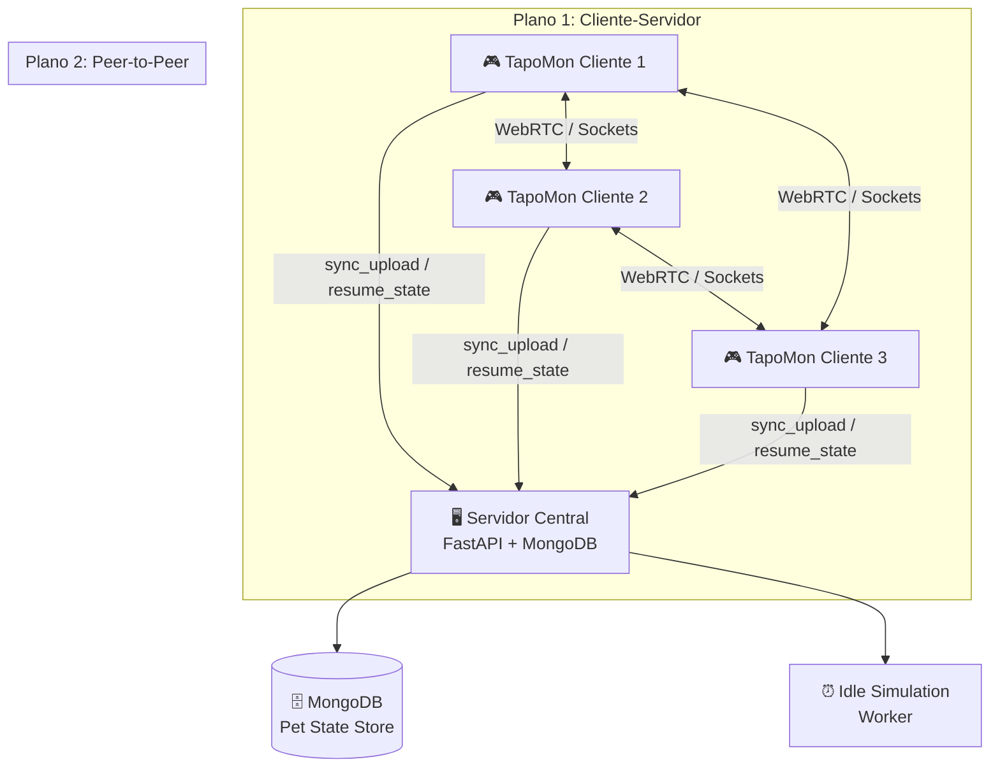
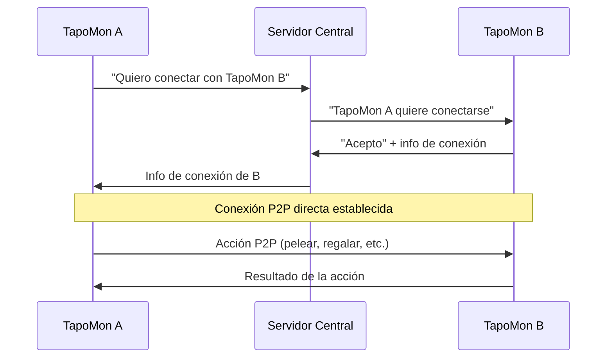
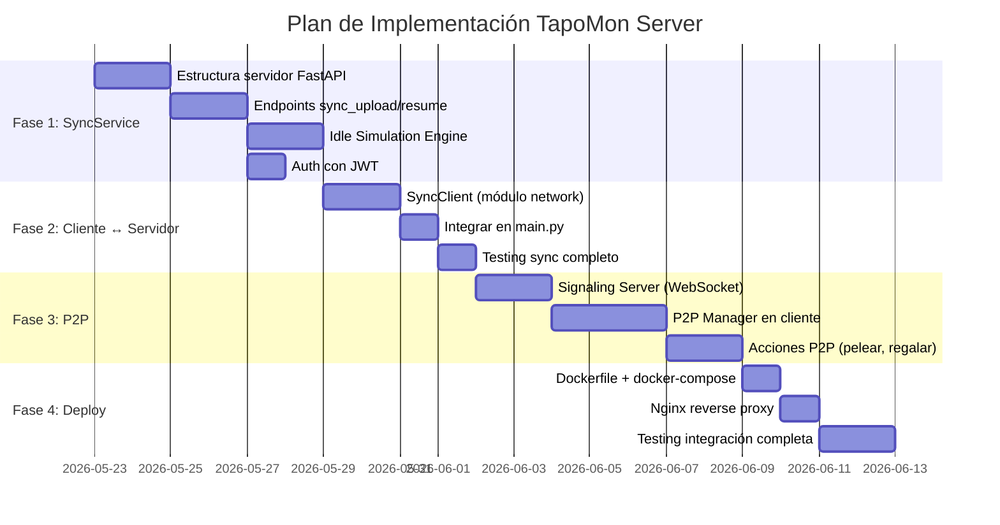

# Plan de Trabajo — Capa de Servidor TapoMon

## Contexto y Estado Actual

El proyecto TapoMon es una mascota virtual distribuida desarrollada por el grupo "Los Topoyiyos" (Universidad Austral de Chile). Actualmente existe un **motor de juego local funcional** con:

| Componente | Archivo | Estado |
|---|---|---|
| Modelo Tapo | [tapo.py](file:///c:/Users/usuario/Desktop/TapoMon/TapoMon/gameEngine/models/tapo.py) | ✅ Implementado |
| Modelo Usuario | [usuario.py](file:///c:/Users/usuario/Desktop/TapoMon/TapoMon/gameEngine/models/usuario.py) | ✅ Implementado |
| Game Engine | [game_engine.py](file:///c:/Users/usuario/Desktop/TapoMon/TapoMon/gameEngine/engine/game_engine.py) | ✅ Implementado |
| DB Local (MongoDB) | [local_db.py](file:///c:/Users/usuario/Desktop/TapoMon/TapoMon/gameEngine/db/local_db.py) | ✅ Implementado |
| Conexión MongoDB | [connection.py](file:///c:/Users/usuario/Desktop/TapoMon/TapoMon/gameEngine/db/connection.py) | ✅ Implementado |
| UI Consola | [console_ui.py](file:///c:/Users/usuario/Desktop/TapoMon/TapoMon/gameEngine/ui/console_ui.py) | ✅ Implementado |
| **Sync Service (Servidor)** | — | ❌ Pendiente |
| **Idle Simulation (Servidor)** | — | ❌ Pendiente |
| **P2P Manager** | — | ❌ Pendiente |

---

## Debate Arquitectónico

### 🏗️ Arquitectura Híbrida: ¿Por qué y cómo?

Tu intuición es correcta. Tenemos **dos planos de comunicación** que coexisten:



### Sobre RMI vs REST

Mencionas RMI (Remote Method Invocation). La comparación es acertada: lo que propones con `sync_upload()` y `resume_state()` es esencialmente **invocar métodos remotos** en el servidor. Sin embargo, para este proyecto recomiendo **REST sobre HTTP** (FastAPI) en lugar de RMI puro por estas razones:

| Aspecto | RMI (Java) | REST/FastAPI (Propuesto) |
|---|---|---|
| Acoplamiento | Alto (interfaces compartidas) | Bajo (JSON sobre HTTP) |
| Lenguaje | Solo Java | Cualquiera (Python nativo) |
| Firewall/NAT | Problemático | Sin problemas (puerto HTTP estándar) |
| Depuración | Difícil | Fácil (curl, Postman) |
| Consistencia con stack | Requiere JVM | Python puro ✅ |

> [!TIP]
> El concepto es el mismo que RMI: exponer métodos del servidor que el cliente invoca de forma transparente. La diferencia es que usamos HTTP/JSON como protocolo de transporte en vez del protocolo propietario de Java RMI. Esto se conoce formalmente como **RPC (Remote Procedure Call) sobre HTTP**.

### El Puerto de Comunicación

Tal como dices, necesitamos un **puerto dedicado** para la comunicación cliente-servidor. La propuesta:

| Servicio | Puerto | Protocolo | Propósito |
|---|---|---|---|
| **SyncService API** | `8000` | HTTP/REST | Upload/Download estado tapo |
| **MongoDB** | `27017` | MongoDB Wire | Persistencia (solo interno) |
| **P2P Signaling** | `8001` | WebSocket | Descubrimiento de peers |
| **P2P Data** | Dinámico | UDP/WebRTC | Datos directos entre tapos |

---

## User Review Required

> [!IMPORTANT]
> **Decisión: ¿FastAPI o Flask para el SyncService?**
> El informe menciona ambos. FastAPI ofrece: async nativo, validación automática con Pydantic, documentación OpenAPI auto-generada, y mejor rendimiento. Flask es más simple pero síncrono. **Recomiendo FastAPI**.

> [!WARNING]
> **Decisión: ¿Idle Simulation como Celery Worker o Background Task de FastAPI?**
> - **Celery + Redis**: Más robusto, escalable, pero requiere infraestructura adicional (Redis broker).
> - **FastAPI BackgroundTasks / APScheduler**: Más simple, todo en un solo proceso, suficiente para el MVP.
> Para esta primera versión propongo **APScheduler dentro de FastAPI** para mantener la complejidad baja, y migrar a Celery cuando se necesite escalar.

## Open Questions

> [!IMPORTANT]
> **1. Protocolo P2P**: ¿Se usará WebRTC (aiortc) como dice el informe, o preferirían TCP/UDP sockets directos? WebRTC es más complejo pero maneja NAT traversal automáticamente.

> [!IMPORTANT]
> **2. Autenticación**: ¿Quieren JWT tokens para proteger los endpoints del SyncService? El informe menciona autenticación en el servidor central. Propongo JWT simple con el hash de password que ya existe.

> [!IMPORTANT]
> **3. ¿El servidor debe correr en Docker desde el inicio?** El informe menciona Docker + Nginx. Podemos empezar sin Docker para desarrollo rápido y dockerizar después.

> [!IMPORTANT]
> **4. Acciones P2P entre tapos**: ¿Cuáles son las acciones concretas cuando dos tapos se encuentran? El informe menciona "pelear" y "enviar regalos". ¿Hay más?

---

## Propuesta de Cambios

### Fase 1 — SyncService API (FastAPI)

El corazón de la comunicación cliente-servidor. Este servicio expone los dos métodos que mencionas.

#### [NEW] [server/](file:///c:/Users/usuario/Desktop/TapoMon/TapoMon/server/) — Directorio del servidor

Nueva estructura del servidor:

```
TapoMon/
├── gameEngine/          # (existente — el cliente)
│   ├── db/
│   ├── engine/
│   ├── models/
│   ├── ui/
│   └── main.py
│
└── server/              # (NUEVO — el servidor central)
    ├── __init__.py
    ├── main.py           # Punto de entrada FastAPI
    ├── config.py         # Configuración (puertos, MongoDB URI, JWT secret)
    ├── api/
    │   ├── __init__.py
    │   ├── sync_routes.py    # Endpoints sync_upload, resume_state
    │   └── auth_routes.py    # Login, verificación de tokens
    ├── services/
    │   ├── __init__.py
    │   ├── sync_service.py   # Lógica de negocio del SyncService
    │   ├── idle_engine.py    # Motor de simulación IDLE del servidor
    │   └── auth_service.py   # Generación y validación de JWT
    ├── models/
    │   ├── __init__.py
    │   └── schemas.py        # Schemas Pydantic (request/response)
    ├── db/
    │   ├── __init__.py
    │   └── mongo.py          # Conexión a MongoDB del servidor (Pet State Store)
    └── requirements.txt
```

---

#### [NEW] server/main.py — Punto de entrada FastAPI

```python
"""
Servidor central TapoMon.
Expone el SyncService para que los clientes suban/descarguen
el estado de sus mascotas, y ejecuta la simulación IDLE.
"""
from fastapi import FastAPI
from api.sync_routes import router as sync_router
from api.auth_routes import router as auth_router

app = FastAPI(title="TapoMon Central Server", version="1.0.0")
app.include_router(auth_router, prefix="/auth", tags=["auth"])
app.include_router(sync_router, prefix="/sync", tags=["sync"])
```

---

#### [NEW] server/api/sync_routes.py — Endpoints del SyncService

Los dos endpoints clave que describes:

```python
@router.post("/upload")
async def sync_upload(tapo_id: str, tapo_state: TapoStateSchema) -> SyncResponse:
    """
    Recibe el 'Snapshot' del cliente cuando se desconecta.
    Lo guarda en el Pet State Store de la base de datos global.
    Equivalente a: sync_upload(tapo_id: ObjectID, tapo_state: JSON) -> Bool
    """
    ...

@router.get("/resume/{usuario_id}")
async def resume_state(usuario_id: str) -> ResumeResponse:
    """
    Descarga el estado actualizado (post-simulación IDLE) 
    y los posibles regalos del Inbox.
    Equivalente a: resume_state(usuario_id: ObjectID) -> JSON
    """
    ...
```

---

#### [NEW] server/services/idle_engine.py — Simulación IDLE en servidor

```python
"""
Replica la lógica de game_engine.aplicar_idle() pero ejecutada
en el servidor para todos los tapos en estado IDLE.
Se ejecuta periódicamente via APScheduler.
"""
class IdleSimulationEngine:
    async def run_tick(self):
        """Ejecuta un tick de degradación para TODOS los tapos IDLE."""
        idle_tapos = await db.find({"Estado_Sistema": False})
        for tapo_doc in idle_tapos:
            self._apply_degradation(tapo_doc)
            await db.save(tapo_doc)
    
    def _apply_degradation(self, tapo_doc: dict):
        """Misma lógica que game_engine pero sin UI."""
        # hambre -= TICK_HAMBRE, energia -= TICK_ENERGIA, etc.
        ...
```

---

### Fase 2 — Modificar Cliente para comunicarse con el Servidor

#### [MODIFY] [main.py](file:///c:/Users/usuario/Desktop/TapoMon/TapoMon/gameEngine/main.py)

Cuando el usuario cierra sesión (opción `"0"` en el bucle de juego), además de guardar localmente, enviar el estado al servidor:

```diff
 if opcion == "0":
     # Cerrar sesión: marcar como IDLE y guardar
     tapo.estado_sistema = False
     local_db.guardar_tapo(tapo)
     local_db.guardar_usuario(usuario)
+    # Enviar snapshot al servidor central
+    from network.sync_client import SyncClient
+    sync = SyncClient()
+    sync.upload_state(tapo)
     ui.mensaje_ok("Sesión cerrada. ¡Tu Tapo te esperará!")
     break
```

Al iniciar sesión, intentar descargar el estado actualizado del servidor:

```diff
 if resultado:
     usuario, tapo = resultado
+    # Intentar recuperar estado del servidor (puede tener simulación IDLE)
+    from network.sync_client import SyncClient
+    sync = SyncClient()
+    server_state = sync.resume(usuario.id)
+    if server_state:
+        tapo = Tapo.from_dict(server_state["tapo"])
+        local_db.guardar_tapo(tapo)
     tapo.estado_sistema = True
     bucle_juego(usuario, tapo)
```

---

#### [NEW] gameEngine/network/ — Módulo de red del cliente

```
gameEngine/network/
├── __init__.py
├── sync_client.py     # Cliente HTTP para comunicarse con SyncService
├── p2p_manager.py     # Gestión de conexiones P2P (Fase 3)
└── config.py          # URL del servidor, timeouts, etc.
```

#### [NEW] gameEngine/network/sync_client.py

```python
"""
Cliente HTTP que se comunica con el SyncService del servidor central.
Usa requests para enviar/recibir el estado del Tapo.
"""
import requests

class SyncClient:
    def __init__(self, server_url: str = "http://localhost:8000"):
        self.base_url = server_url
    
    def upload_state(self, tapo: Tapo) -> bool:
        """sync_upload: Envía el snapshot al servidor."""
        resp = requests.post(
            f"{self.base_url}/sync/upload",
            params={"tapo_id": tapo.id_mascota},
            json=tapo.to_dict()
        )
        return resp.status_code == 200
    
    def resume(self, usuario_id: str) -> dict | None:
        """resume_state: Descarga estado actualizado + regalos."""
        resp = requests.get(f"{self.base_url}/sync/resume/{usuario_id}")
        if resp.status_code == 200:
            return resp.json()
        return None
```

---

### Fase 3 — Comunicación P2P entre Tapos

> [!NOTE]
> Esta fase se implementará después de tener el servidor funcionando. Requiere un mecanismo de **señalización** (signaling) para que los peers se descubran entre sí.

#### Flujo P2P propuesto:



#### [NEW] gameEngine/network/p2p_manager.py

```python
"""
Gestor de conexiones P2P entre TapoMon.
Usa sockets TCP para comunicación directa entre peers.
El servidor central actúa como 'signaling server' para descubrimiento.
"""
class P2PManager:
    def discover_peers(self) -> list[PeerInfo]:
        """Consulta al servidor qué tapos están ACTIVE."""
        ...
    
    def connect(self, peer: PeerInfo) -> P2PConnection:
        """Establece conexión directa con otro tapo."""
        ...
    
    def send_gift(self, connection: P2PConnection, gift: dict):
        """Envía un regalo a través de la conexión P2P."""
        ...
    
    def request_battle(self, connection: P2PConnection):
        """Solicita una batalla con otro tapo."""
        ...
```

---

### Fase 4 — Dockerización y Despliegue

#### [NEW] docker-compose.yml

```yaml
version: "3.9"
services:
  tapomon-server:
    build: ./server
    ports:
      - "8000:8000"   # SyncService API
      - "8001:8001"   # P2P Signaling (WebSocket)
    environment:
      - MONGO_URI=mongodb://mongo:27017
      - MONGO_DB=Tapomon
    depends_on:
      - mongo

  mongo:
    image: mongo:7.0
    ports:
      - "27017:27017"
    volumes:
      - mongo_data:/data/db

volumes:
  mongo_data:
```

---

## Resumen de Fases y Orden de Implementación



## Verificación

### Automated Tests
- **Fase 1**: `pytest` con `httpx.AsyncClient` para testear endpoints del SyncService
- **Fase 2**: Test de integración: levantar servidor → cliente sube estado → servidor calcula idle → cliente descarga estado actualizado
- **Fase 3**: Test P2P: dos clientes se descubren, conectan, y ejecutan una acción

### Manual Verification
- Levantar servidor en una terminal, cliente en otra
- Cerrar sesión en el cliente → verificar que el estado aparece en MongoDB del servidor
- Esperar X minutos → reconectar → verificar que la degradación IDLE se aplicó
- Dos clientes simultáneos → verificar descubrimiento P2P y acciones entre tapos
